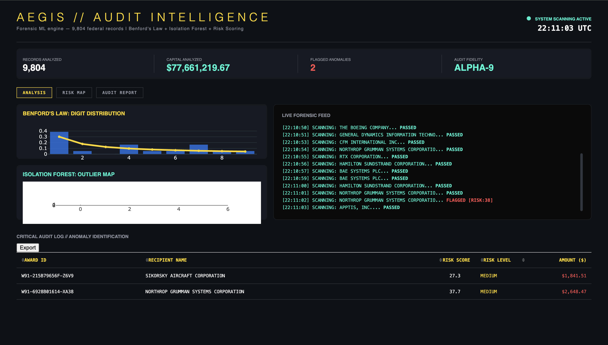

# Aegis: Public Expenditure Anomaly Detector

An automated engine for detecting federal expenditure anomalies. Utilizes a dual-layer forensic pipeline to scrub high-velocity spending data and reconstruct fiscal patterns into formal audit logs, enabling early detection of financial fraud and systemic waste.

## Dashboard Preview

## Technical Stack
- **Language:** Python 3.10+
- **Framework:** Plotly Dash (Forensic Visualization)
- **Data Processing:** Pandas, Scikit-Learn (Outlier Detection Logic)
- **Data Source:** USASpending API & Gov Records

## Core Functionality
- **Forensic Auditing:** Automated detection of digit-frequency deviations in transaction amounts using Benford's Law.
- **Anomaly Identification:** A machine learning engine that flags high-risk transactions via Isolation Forest outlier detection.
- **Live Ledger Generation:** A real-time auditing feed that reconstructs spending patterns into subject-led audit logs and risk levels.

## How to Run
1. Clone the repository: `git clone https://github.com/Kenneth-Thakur/Aegis-Detector.git`
2. Install dependencies: `pip install dash pandas requests scikit-learn plotly`
3. Run the application: `python aegis_final.py`
