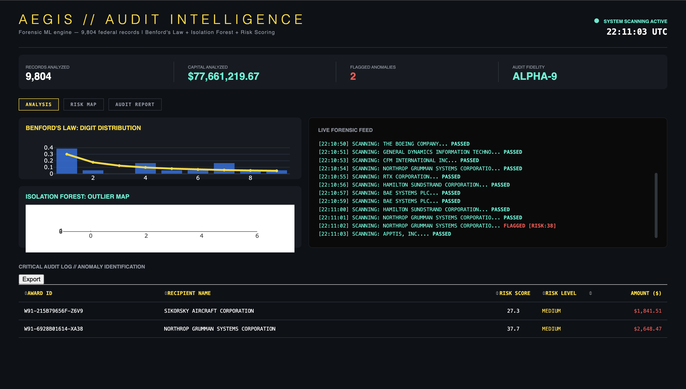

# Aegis: Public Expenditure Anomaly Detector

A forensic ML engine that analyzes 10,000+ federal spending records using Isolation Forest, Benford's Law, and composite risk scoring.

## Dashboard Preview

## Technical Stack
- **Language:** Python 3.10+
- **Framework:** Plotly Dash (Forensic Visualization)
- **Data Processing:** Pandas, Scikit-Learn (Outlier Detection Logic)
- **Data Source:** USASpending API & Gov Records

## Core Functionality
- **Forensic Auditing:** Detects anomalies in spending data using Benford's Law digit-frequency analysis.
- **Anomaly Identification:** A machine learning engine that flags high-risk transactions via Isolation Forest outlier detection.
- **Live Ledger Generation:** Real-time scanning feed that flags and logs high-risk transactions.

## How to Run
1. Clone the repository: `git clone https://github.com/Kenneth-Thakur/Aegis-Detector.git`
2. Install dependencies: `pip install -r requirements.txt`
3. Run the application: `python aegis.py`
